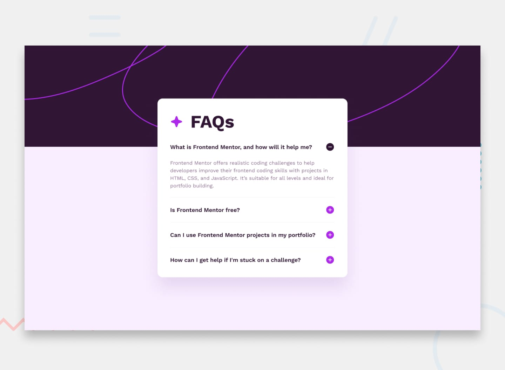

# FAQ accordion| Frontend Mentor Challenge

This challenge is part of my journey to master responsive design with HTML, CSS & JavaScript

## Live Preview
https://jmg002050.github.io/FAQ-accordion/

## 📸 Preview

## Features

* Responsive layout for mobile and desktop screens
* Animated buttons

## Built With

* HTML5
* CSS3
* JavaScript

## What I Learned

While building this project, I practiced:

* Starting the layout with a mobile-first approach, using percentages rather than fixed values (px), and defining the required containers to organize the content along with clamp and min widths
* Positioning elements relative to one another
* Structuring HTML for maintainability and readability
* Made sure to follow the original design as close as possible
* Make sure to select the right elements using JS to ensure smooth and easy interaction

## Challenges

One of the biggest challenges was making sure all the elements aligned correctly and were centered on the page. Still having some problems remembering the parent child relationship but that is why we must practice

The design required me to explore different approaches and possible solutions especially using responsive design without breaking the website

I had to analyze how each element, `div`, and `section` interacted with the others, main `containers` and `body`

Also, there still a lot of JS that I need to use to make sure I can accomplish the right interactivity

## Future Improvements

* Expanding the site with more elements

## Acknowledgements

Challenge provided by Frontend Mentor, Conquering Responsive Design.

## Author

Jorge Martinez

* [GitHub: https://github.com/yourusername](https://github.com/JMG002050)
* https://www.frontendmentor.io/
